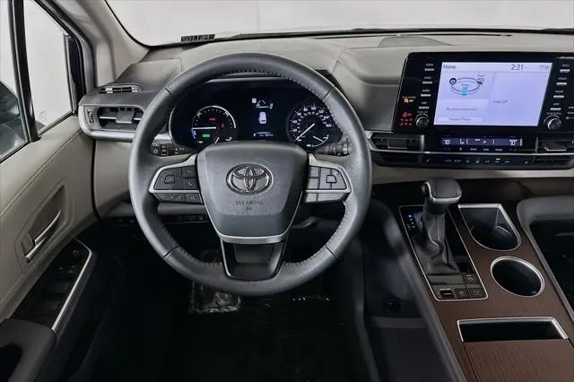

<html lang="en">
<head>
    <meta charset="UTF-8">
    <meta name="viewport" content="width=device-width, initial-scale=1.0">
    <title>Al Rayyan Transportation, LLC</title>
    
    <link rel="preconnect" href="https://fonts.googleapis.com">
    <link rel="preconnect" href="https://fonts.gstatic.com" crossorigin>
    <link href="https://fonts.googleapis.com/css2?family=Inter:wght@400;500;700&display=swap" rel="stylesheet">
    
    
    
    
</head>
<body>

    <!-- Header with Navigation -->
    <header id="top" class="bg-white/80 backdrop-blur-sm p-2 md:p-4 rounded-b-xl shadow-lg w-full sticky top-0 z-50">
      

        <h1 class="text-xl md:text-2xl font-bold text-gray-900 mb-2 md:mb-0">Al Rayyan Transportation, LLC</h1>
        <nav class="flex flex-wrap justify-center gap-2 mt-2 md:mt-0">
          <a href="#book-now" class="px-4 py-2 rounded-lg text-gray-400 font-medium hover:bg-gray-200 transition-colors duration-200">Home</a>
          <a href="#about" class="px-4 py-2 rounded-lg text-gray-400 font-medium hover:bg-gray-200 transition-colors duration-200">About</a>
          <a href="#fleet" class="px-4 py-2 rounded-lg text-gray-400 font-medium hover:bg-gray-200 transition-colors duration-200">My Vehicle</a>
          <a href="#rates" class="px-4 py-2 rounded-lg text-gray-400 font-medium hover:bg-gray-200 transition-colors duration-200">Rates</a>
        </nav>
      

    </header>

    <!-- Book Now Section -->
    <section id="book-now" class="min-h-screen flex items-center justify-center py-16 px-4">
        

            <h2 class="text-5xl font-extrabold text-gray-900 text-center mb-4">Your Stress-Free Private Car Service</h2>
            
Arrive relaxed and ready for adventure. We offer seamless private transportation for families from Orlando to all major destinations.

            
            <h3 class="text-3xl font-bold text-gray-900 text-center mb-6">Book Your Ride</h3>
            <form id="fareRequestForm" class="space-y-6">
                

                    <label for="name" class="block text-sm font-medium text-gray-700">Your Full Name</label>
                    <input type="text" id="name" name="name" required class="mt-1 form-input">
                

                

                    <label for="email" class="block text-sm font-medium text-gray-700">Email Address</label>
                    <input type="email" id="email" name="email" required class="mt-1 form-input">
                

                

                    <label for="phone" class="block text-sm font-medium text-gray-700">Phone Number</label>
                    <input type="tel" id="phone" name="phone" required class="mt-1 form-input">
                

                

                    <label for="pickup" class="block text-sm font-medium text-gray-700">Pickup Location</label>
                    <input type="text" id="pickup" name="pickup" required class="mt-1 form-input">
                

                

                    <label for="dropoff" class="block text-sm font-medium text-gray-700">Drop-off Location</label>
                    <input type="text" id="dropoff" name="dropoff" required class="mt-1 form-input">
                

                

                    

                        <label for="date" class="block text-sm font-medium text-gray-700">Date</label>
                        <input type="date" id="date" name="date" required class="mt-1 form-input">
                    

                    

                        <label for="time" class="block text-sm font-medium text-gray-700">Time</label>
                        <input type="time" id="time" name="time" required class="mt-1 form-input">
                    

                

                

                    

                        <label for="passengers" class="block text-sm font-medium text-gray-700">Number of Passengers</label>
                        <input type="number" id="passengers" name="passengers" min="1" required class="mt-1 form-input">
                    

                    

                        <label for="luggage" class="block text-sm font-medium text-gray-700">Number of Luggage</label>
                        <input type="number" id="luggage" name="luggage" min="0" required class="mt-1 form-input">
                    

                

                

                

                    <button type="submit" class="w-full bg-blue-600 text-white py-3 px-4 rounded-lg font-semibold hover:bg-blue-700 transition-colors duration-200 focus:outline-none focus:ring-2 focus:ring-blue-500 focus:ring-offset-2">
                        Request a Quote
                    </button>
                

            </form>
        

    </section>

    <!-- About Section -->
    <section id="about" class="py-16 px-4 bg-gray-50">
        

            <h2 class="text-4xl font-bold text-gray-900 mb-6">About Al Rayyan Transportation</h2>
            

                Al Rayyan Transportation is your premier partner for reliable and comfortable private transportation in Central Florida. As the owner and sole operator, I am dedicated to providing a safe and stress-free experience for families and travelers in my top-of-the-line vehicle. My commitment to punctuality, professionalism, and impeccable customer service ensures your journey is as smooth as your destination. I believe that your travel experience should be effortless, which is why I offer transparent pricing and personalized service to meet your needs. Let me take the wheel while you sit back and enjoy the ride.
            

        

    </section>

    <!-- Our Fleet Section -->
    <section id="fleet" class="py-16 px-4 bg-gray-50">
        

            <h2 class="text-4xl font-bold text-gray-900 text-center mb-6">My Vehicle</h2>
            

                Travel in comfort and style in my well-maintained vehicle.
            

            

                
                
                
                
                
                
                
            

        

    </section>

    <!-- Rates Section -->
    <section id="rates" class="bg-white py-16 px-4">
        

            <h2 class="text-4xl font-bold text-gray-900 text-center mb-6">Al Rayyan Rate</h2>
            

                

                    Looking for premium Orlando transportation services? Al Rayyan Transportation offers a seamless and stress-free travel experience across Central Florida. We specialize in reliable Disney World transportation, hassle-free MCO airport transfers, and efficient Port Canaveral transportation, with tailored options for every need.
                

                

                    Our highly-rated transportation solutions prioritize your comfort, safety, and style, ensuring a smooth journey every time. Enjoy top-tier service without breaking the bank thanks to our affordable pricing.
                

                

                    Choose Al Rayyan Transportation for dependable, budget-friendly, and family-friendly travel services in Orlando. Experience the difference of a truly premium ride!
                

            

            

                <!-- Orlando to WDW -->
                

                    <h4 class="text-xl font-bold text-gray-900 mb-2">Orlando International Airport to Walt Disney World Resort Area</h4>
                    <ul class="mt-4 space-y-2">
                        <li>
                            
Al Rayyan Exclusive

                            
Starting at $60 Each Way

                        </li>
                    </ul>
                

                <!-- Orlando to Universal -->
                

                    <h4 class="text-xl font-bold text-gray-900 mb-2">Orlando International Airport to Universal Orlando Resort Area</h4>
                    <ul class="mt-4 space-y-2">
                        <li>
                            
Al Rayyan Exclusive

                            
Starting at $50 Each Way

                        </li>
                    </ul>
                

                 <!-- MCO to Downtown Orlando -->
                

                    <h4 class="text-xl font-bold text-gray-900 mb-2">Orlando International Airport to Downtown Orlando</h4>
                    <ul class="mt-4 space-y-2">
                        <li>
                            
Al Rayyan Exclusive

                            
Starting at $40 Each Way

                        </li>
                    </ul>
                

                 <!-- MCO to Champions Gate -->
                

                    <h4 class="text-xl font-bold text-gray-900 mb-2">Orlando International Airport to Champions Gate</h4>
                    <ul class="mt-4 space-y-2">
                        <li>
                            
Al Rayyan Exclusive

                            
Starting at $75 Each Way

                        </li>
                    </ul>
                

                
                <!-- Orlando to Port Canaveral -->
                

                    <h4 class="text-xl font-bold text-gray-900 mb-2">Orlando International Airport to Port Canaveral</h4>
                    <ul class="mt-4 space-y-2">
                        <li>
                            
Al Rayyan Exclusive

                            
Starting at $90 Each Way

                        </li>
                    </ul>
                

                <!-- WDW to Port Canaveral -->
                

                    <h4 class="text-xl font-bold text-gray-900 mb-2">Walt Disney World Resort Area to Port Canaveral</h4>
                    <ul class="mt-4 space-y-2">
                        <li>
                            
Al Rayyan Exclusive

                            
Starting at $120 Each Way

                        </li>
                    </ul>
                

                 <!-- Disney to Sanford Internaltion -->
                

                    <h4 class="text-xl font-bold text-gray-900 mb-2">Disney to Sanford International Airport</h4>
                    <ul class="mt-4 space-y-2">
                        <li>
                            
Al Rayyan Exclusive

                            
Starting at $90 Each Way

                        </li>
                    </ul>
                

            

        

    </section>

    <!-- Footer -->
    <footer class="bg-gray-900 text-white py-8">
        

            
&copy; 2024 Al Rayyan Transportation, LLC. All rights reserved.

            
Designed and Developed by Al Rayyan Transportation

        

    </footer>

    

</body>
</html>
